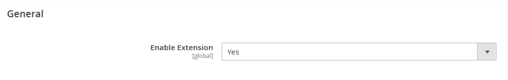

# Magento 2 PreDefined Admin Order Comments Module
The mavenbird/module-predefined-order-admin-comments module for Magento 2 enhances order management by allowing administrators to add predefined comments to orders. This extension streamlines the process of adding common comments to orders, improving efficiency and consistency in order management.

## Key Features:
- **Predefined Comments:**
Set up a list of predefined comments that can be quickly added to orders.
- **Customizable Comment List:**
Admins can define and manage a list of standard comments for various scenarios.
- **Efficient Order Management:**
Streamline the process of adding comments to orders with a user-friendly dropdown menu.
- **Consistency:**
Ensure uniformity in order comments across your store with predefined options.
- **Easy Integration:**
Seamlessly integrates into the Magento 2 admin order management interface.

## Benefits:
- **Efficiency:**
Save time by using predefined comments for common order scenarios.
- **Consistency:**
Maintain consistency in communication by standardizing order comments.
- **Ease of Use:**
Simplify the process of adding comments with an intuitive dropdown menu.
- **Flexibility:**
Customize and update the list of predefined comments to suit your business needs.

## Compatibility:
This extension is compatible with Magento 2.4.X (PHP - 8.1 - 8.3) version.

## Installation:
*Install via composer (recommend)* - 

Easy installation process with step-by-step instructions provided for hassle-free setup.
~~~~~~~~~~~~~~~~~~~~~
php bin/magento module:enable mavenbird/module-predefined-order-admin-comments
php bin/magento setup:upgrade
php bin/magento setup:static-content:deploy
php bin/magento cache:flush
Manual Installation:
Download the latest release from GitHub releases.
~~~~~~~~~~~~~~~~~~~~~

## Upgrade/Update Module:
Run the following command in Magento 2 root folder for easy update -
~~~~~~~~~~~~~~~~~~~~~
php bin/magento module:enable mavenbird/module-predefined-order-admin-comments
php bin/magento setup:upgrade
php bin/magento setup:static-content:deploy
php bin/magento cache:flush
~~~~~~~~~~~~~~~~~~~~~

## Customization Options:

## Support:
Dedicated support team available to assist with installation, customization, and any other queries or concerns.
*[support@mavenbird.com](mailto:support@mavenbird.com)* 

## Get Started:
Enhance your Magento 2 store’s order management efficiency with the mavenbird/module-predefined-admin-order-comments module. This module allows you to streamline communication by providing predefined order comments that can be quickly applied to orders from the admin panel.

*Thank you!*
